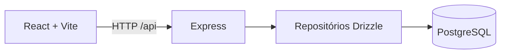
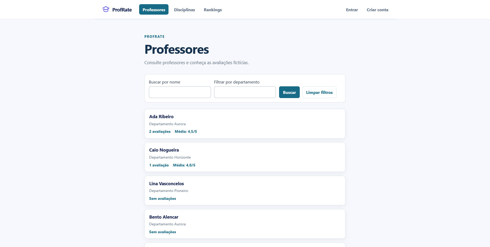
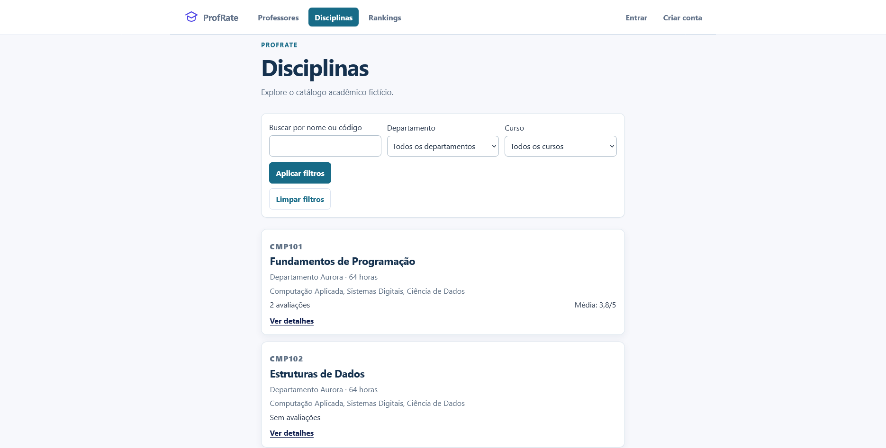
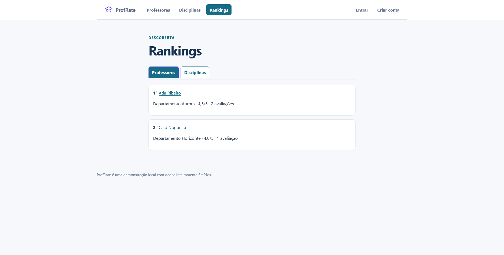
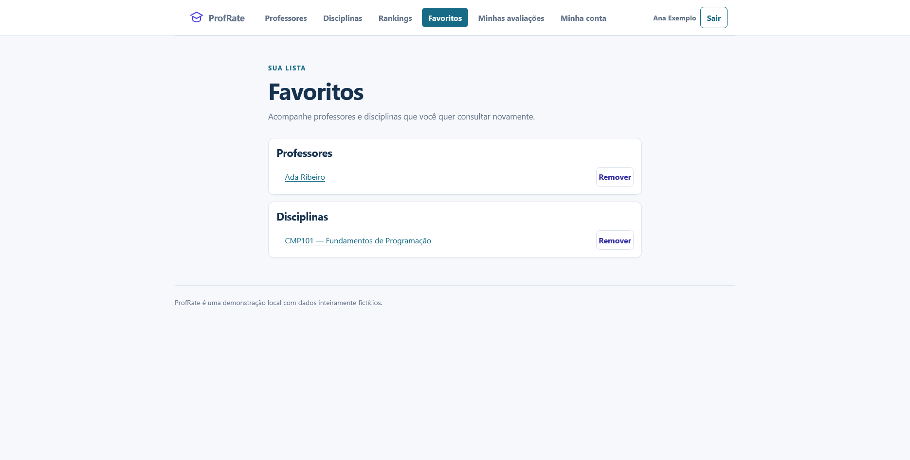
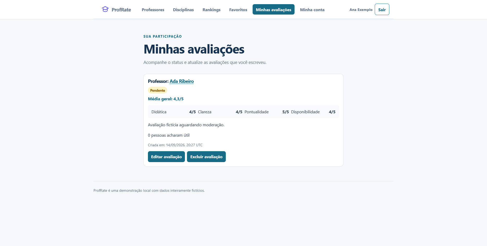
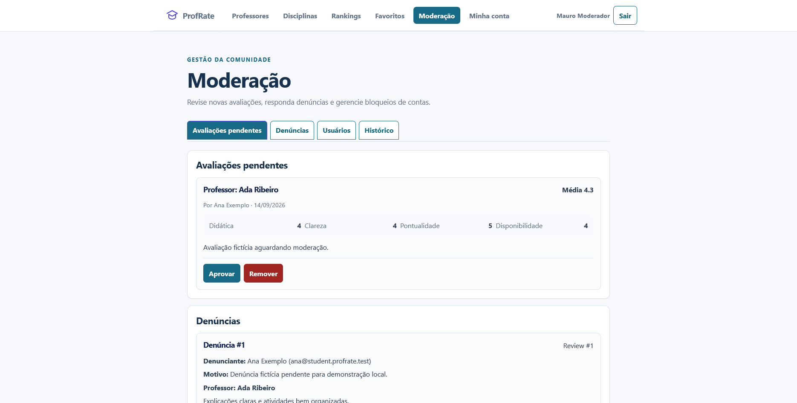
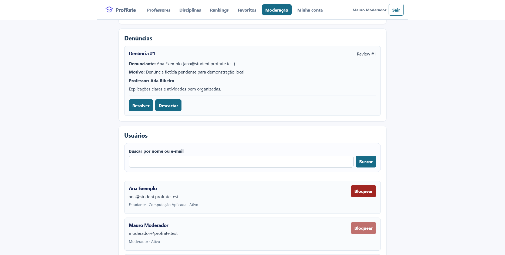
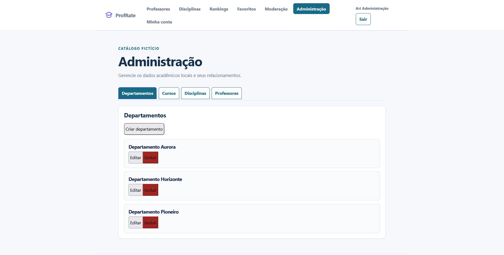

# ProfRate

Projeto pessoal, educacional e de portfólio para estudar APIs, banco de dados e testes. É uma demonstração **local**: professores, disciplinas, avaliações e contas são inteiramente fictícios. Não é serviço público e não tem vínculo, afiliação ou representação da UFC.

## O que demonstra

Visitantes consultam catálogo, avaliações publicadas e rankings. Estudantes gerenciam conta, avaliações, favoritos e votos úteis. Moderadores analisam conteúdo, denúncias, usuários e logs; administradores mantêm o catálogo acadêmico.



Recursos: professores, departamentos, cursos e disciplinas; filtros, ordenação e paginação; avaliações estruturadas; autenticação e recuperação de senha; favoritos, rankings e votos úteis; denúncias, moderação e administração.

| Perfil | Acesso |
| --- | --- |
| Visitante | Catálogo, detalhes, avaliações publicadas e rankings |
| Estudante | Avaliações próprias, favoritos, votos úteis e conta |
| Moderador | Revisão, denúncias, usuários e histórico |
| Administrador | Moderação e manutenção do catálogo |

## Arquitetura

Monorepo pnpm com `apps/web` (React, React Router e Vite) e `apps/api` (Express 5, Zod, Drizzle ORM e PostgreSQL 18). O Vite encaminha `/api` à API local. Migrations versionadas e seed repetível sustentam o ambiente.

Segurança: validação Zod, senhas bcrypt, JWT HS256 com expiração e verificação do usuário atual, autorização por papel, bloqueio temporário de login e tokens de redefinição com hash e expiração.

## Executar localmente

Pré-requisitos: Node.js 24, pnpm 11 e Docker Desktop.

```sh
pnpm install --frozen-lockfile
```

Copie `.env.example` para `.env`, defina uma senha local para `POSTGRES_PASSWORD`, use-a em `DATABASE_URL` e substitua `AUTH_JWT_SECRET` por um segredo local de ao menos 32 caracteres.

```sh
docker compose up -d
pnpm --filter @profrate/api db:migrate
pnpm --filter @profrate/api db:seed
pnpm --filter @profrate/api db:check
```

Em dois terminais:

```sh
pnpm --filter @profrate/api dev
pnpm --filter @profrate/web dev
```

Abra `http://localhost:5173`. Para encerrar o banco preservando dados: `docker compose down` (sem `-v`).

### Contas fictícias

| Perfil | E-mail | Senha |
| --- | --- | --- |
| Estudante | `ana@student.profrate.test` | `ProfRate#2026Aluno` |
| Moderador | `moderador@profrate.test` | `ProfRate#2026Moderador` |
| Administrador | `admin@profrate.test` | `ProfRate#2026Admin` |

## Qualidade

```sh
pnpm check
pnpm test:integration
```

`pnpm check` reúne typecheck, testes e build. A CI executa essa verificação e testes PostgreSQL de integração separadamente.

## Galeria

|  |  |
| --- | --- |
| Professores | Detalhe da disciplina |
|  |  |
| Rankings | Favoritos |
|  |  |
| Minhas avaliações | Moderação: pendências |
|  |  |
| Moderação: denúncias e usuários | Administração |

## Documentos

- [Arquitetura](docs/architecture.md)
- [Roteiro de demonstração](docs/demo.md)
- [Visão](docs/vision.md), [escopo](docs/scope.md) e [roadmap](docs/roadmap.md)
- [ADR 0001](docs/decisions/0001-stack-inicial.md)

## Limitações

O projeto é uma demonstração local com dados fictícios, sem operação pública. Não há licença definida para este repositório.
